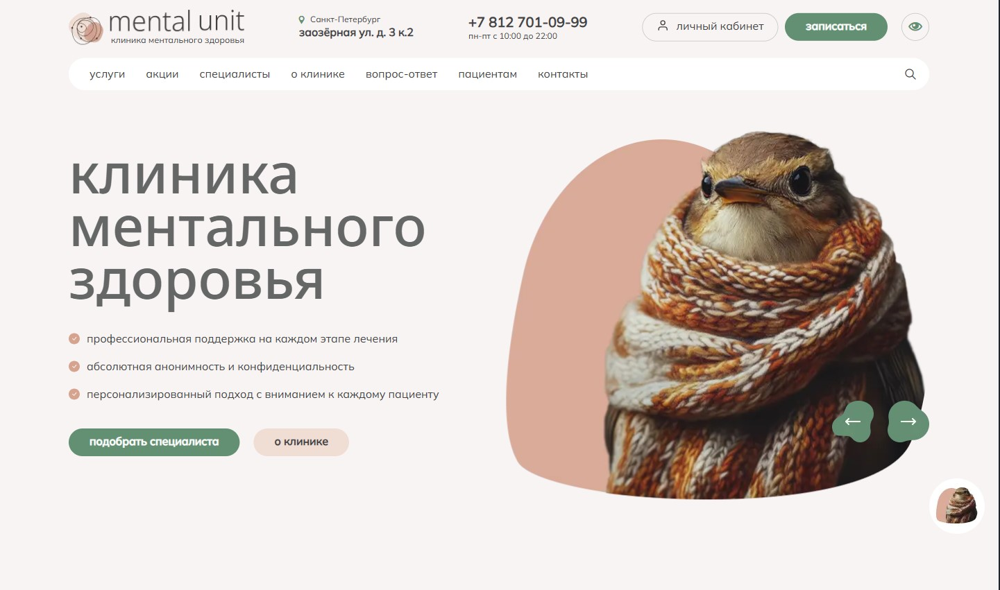
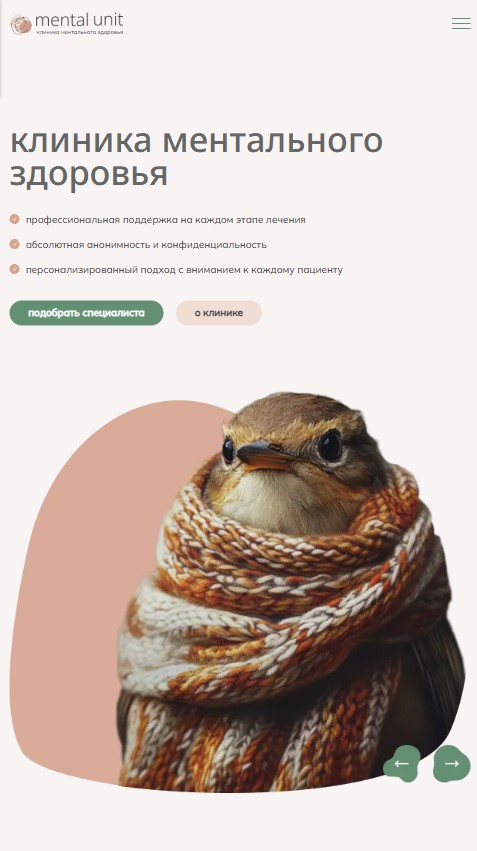

# Mental Unit — Brand Website

A responsive multi-page site built from a ready-made Figma design — plain HTML, CSS, and JavaScript, no frameworks. Includes custom fonts and image assets matching the original design.

🔗 **Demo:** https://zhuridochka.github.io/Mental-unit-show/services.html#

## Screenshots

| Desktop | Mobile |
|---|---|
|  |  |
|  |  |

## Pages
- `index.html` — entry page
- `home.html` — home
- `services.html` — services

## Features
- Pixel-accurate layout matching the design — spacing, fonts, colors
- Custom web fonts and icon/image assets from the design
- Responsive across desktop / tablet / mobile / mobile-small

## Stack
`HTML5` `CSS3` `JavaScript` · design — `Figma`
